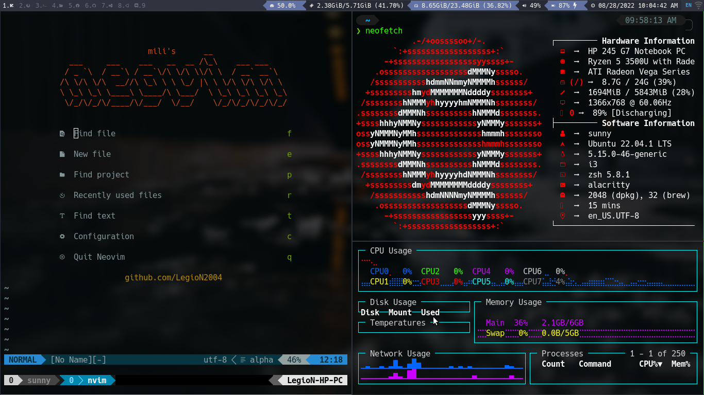
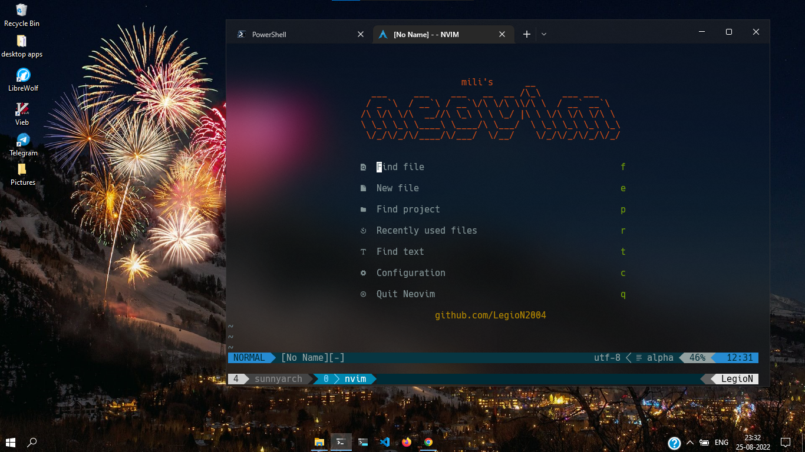

## Here is an image of my setup of neovim, tmux, and i3wm 

You can also use this in wsl2

My neovim is highly inspired by  neovim for the aesthetics so credits goes to him and I liked his setup too much but max of my configuration is mine 

This is a backup of my dotfiles for my ubuntu and windows machine  . Feel free to copy any xmonad , i3 or neovim config if you like em , i also have some config files for other foss softwares . :)

I will add some pictures once I get hold of how to use  markdown for better view of what my dotflies contains

You can directly copy my neovim config and add it to the .config folder for unix systems and it will automatically set up everything for you 
